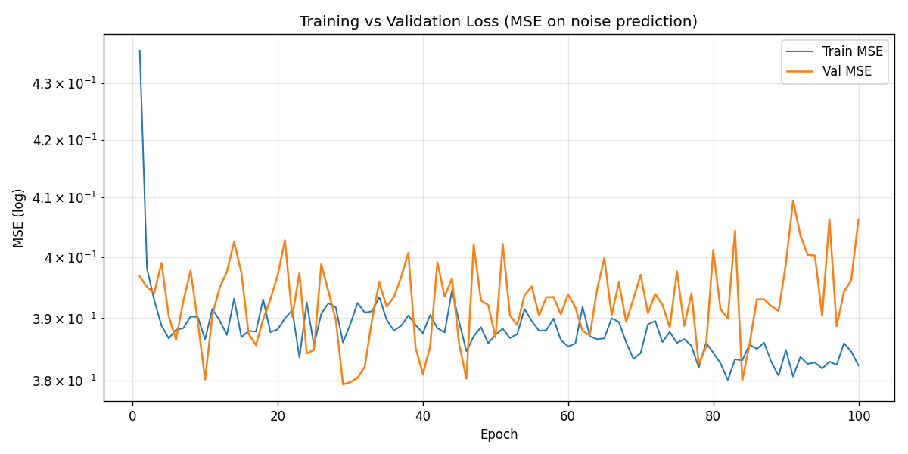
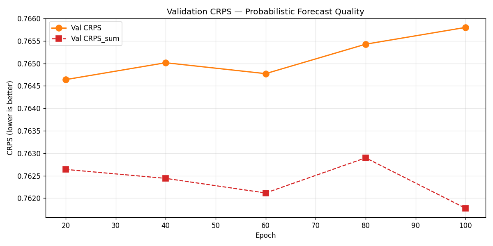
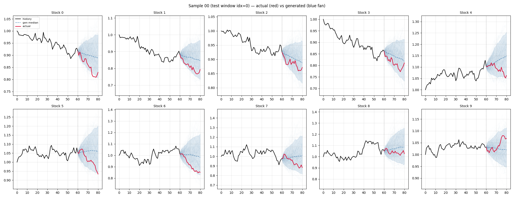

# Stock DDPM — Conditional Diffusion for Multi-Stock Forecasting

A from-scratch reproduction of conditional denoising diffusion probabilistic models for **multi-stock probabilistic forecasting**, combining:

- **CSDI** (Tashiro et al., NeurIPS 2021) — 2D attention over (time × feature) axes
- **TimeGrad** (Rasul et al., ICML 2021) — Gated activation + dilated 1D convolution

Trained on synthetic Geometric Brownian Motion (GBM) with a fixed 10×10 correlation matrix, the model generates probabilistic forecasts of the next 20 days given the prior 60 days of log returns.

---

## Results

| Sampler         | Steps | CRPS    | CRPS_sum | Speedup |
| --------------- | ----- | ------- | -------- | ------- |
| DDPM-50         | 50    | 0.7679  | 0.7711   | 1×      |
| **DDIM-10**     | 10    | 0.7698  | 0.7722   | **5×**  |

DDIM-10 is within 0.3% of DDPM-50 quality at 5× faster sampling. The 0.77 CRPS appears to be the **intrinsic floor** for pure GBM (its log-returns are unforecastable white noise — only the cross-sectional correlation structure is learnable).





---

## Architecture

```
x_cond:(B,10,60) ──┐                                  ┌── eps:(B,10,20)
                   ├─ concat → (B,1,10,80) value      │
y_t:(B,10,20)  ────┘    + (B,1,10,80) cond_mask       │
                                ↓                     │
                       Conv2d(2 → 64)                 │
                                ↓                     │
              4 × ResidualBlock with                  │
              ┌──────────────────────────┐            │
              │ Time-axis Transformer    │            │
              │ Feature-axis Transformer │            │
              │ Dilated Conv1d (cycle=2) │            │
              │ Side-info injection      │            │
              │ Gated act σ(g)⊙tanh(f)   │            │
              │ Residual / √2            │            │
              └──────────────────────────┘            │
                                ↓                     │
                Skip aggregation → Conv → output ─────┘
```

- Diffusion step embedding: 128-dim sinusoidal → 2× Linear with SiLU
- Feature (stock-id) embedding: 16-dim learnable
- Quadratic β schedule: β = linspace(√1e-4, √0.5, 50)² — gives α̅_N ≈ 3e-5 (near-perfect Gaussian endpoint)
- ~445K parameters

---

## Setup

```bash
pip install torch numpy matplotlib
```

Tested on Python 3.14 + PyTorch (CUDA 12.x).

---

## Run

**Full training (default: 20 seeds × T=2000 × 100 epochs, ≈ 3 hours on consumer GPU):**

```bash
python main.py
```

**Smoke test (5 seeds × T=800 × 10 epochs, ≈ 5 minutes):**

```bash
python main.py --smoke
```

**Resume from checkpoint:**

```bash
python main.py --resume checkpoints/latest.pt
```

**Other flags:**

```bash
python main.py --n_seeds 50 --epochs 200 --batch_size 128 \
               --val_every_epoch 20 --ckpt_every_epoch 20 \
               --ckpt_dir ./checkpoints --out_dir ./figures
```

---

## Outputs

After a run:

- `training_vs_validation.png` — Train MSE vs Val MSE (per-epoch, log y-axis)
- `crps_curve.png` — Val CRPS / CRPS_sum (probabilistic forecast quality)
- `sample_actual_vs_gen_NN.png` — 10 fan-chart subplots (2×5 grid) showing actual vs generated paths for all 10 stocks on selected test windows
- `checkpoints/ckpt_epoch{20,40,60,80,100}.pt` + `latest.pt` — full state for resume / inference
- `logs/train_*.log` — stdout

---

## File layout

```
project3/
├── generate_data.py    GBM data generator, multi-seed Cholesky paths
├── dataset.py          Sliding-window Dataset with Z-score normalization
├── model.py            ConditionalDenoiser (CSDI 2D attn + TimeGrad gated dilated)
├── ddpm.py             StockDDPM scheduler, DDIM sampler, EMA, train loop, checkpointing
├── crps.py             GluonTS quantile-loss CRPS / CRPS_sum
├── main.py             End-to-end pipeline entry point
├── .gitignore
├── checkpoints/        Saved model states (gitignored)
├── logs/               Persisted training stdout
└── *.png               Result figures
```

---

## Key design decisions

| Choice | Reason |
| --- | --- |
| Quadratic β with β_end=0.5 | Linear β_end=0.02 leaves α̅_N ≈ 0.37 (not Gaussian); quadratic gives α̅_N ≈ 3e-5 |
| Multi-seed data (20 × 2000) | Shared Cholesky of the same correlation matrix preserves covariance structure while providing 100× more independent windows than a single long series |
| Per-window Z-score | Avoids data leakage; mean/std stored for inverse transform during evaluation |
| EMA decay=0.999 | Sampling uses shadow weights; standard DDPM practice |
| MultiStepLR @ [75, 90] × 0.1 | Mirrors CSDI's 200-epoch [150, 180] schedule, scaled to 100 epochs |
| Sample clamp at ±10 | Guardrail against under-trained model divergence (we observed std=194 at smoke-test epoch 5) |

---

## Acknowledgements

This README was drafted with the assistance of [Claude](https://www.anthropic.com/claude) (Anthropic).

## References

- Tashiro, Y., Song, J., Song, Y., & Ermon, S. (2021). CSDI: Conditional Score-based Diffusion Models for Probabilistic Time Series Imputation. *NeurIPS*. [code](https://github.com/ermongroup/CSDI)
- Rasul, K., Seward, C., Schuster, I., & Vollgraf, R. (2021). Autoregressive Denoising Diffusion Models for Multivariate Probabilistic Time Series Forecasting. *ICML*. [code](https://github.com/zalandoresearch/pytorch-ts)
- Ho, J., Jain, A., & Abbeel, P. (2020). Denoising Diffusion Probabilistic Models. *NeurIPS*.
- Song, J., Meng, C., & Ermon, S. (2021). Denoising Diffusion Implicit Models. *ICLR*.
